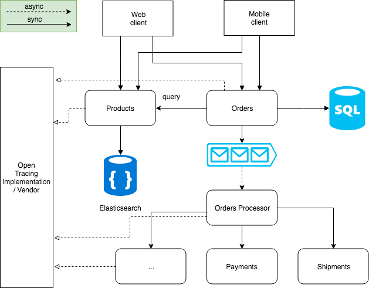
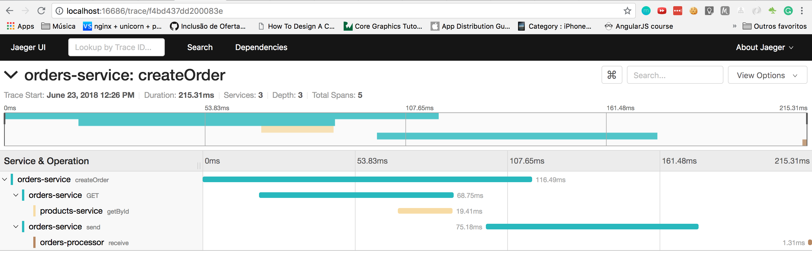
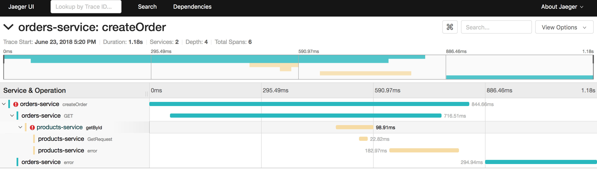

[](https://travis-ci.org/emersonborges/skip-the-dishes)
[](https://codecov.io/gh/emersonborges/skip-the-dishes)
# Skip the dishes

## Running
* ```docker-compose up```
* ```mvn clean install```
* ```java -jar skip-the-dishes-products/target/skip-the-dishes-products.jar```
* ```java -jar skip-the-dishes-orders/target/skip-the-dishes-orders.jar```
* ```java -jar skip-the-dishes-orders-processor/target/skip-the-dishes-orders-processor.jar```

### Endpoints
* producs: http://localhost:8080/products
* orders: http://localhost:8081/orders
* elasticsearch: http://localhost:9092
* jaeger ui: http://localhost:16686

## Architecture 
Microservices architecture separated by products and orders domain.

 

* The products domain has a REST API with CRUD operations and is used for full-text search on products attributes. 
It uses Elasticsearch for persistence that is a very scalable document database, 
with built in indexing and full-text search.

* Orders domain has a REST API for orders CRUD operations and a orders processor, 
that handles all the orders flow after it is created, like payment, shipping and other 
processes specific to the business.
    * Orders REST API uses Postgres for persistence with your own database, 
    separated from other domain's database. In this way, it will not concur with other applications.
    After it persists in Postgres it publishes a ```OrderCreated``` event for 
    orders processor and any application that is interested in this event.
    * Orders Processor process orders Events asynchronously, reading events 
    from Kafka and processing all the business logic by communicating with 
    another microservices needed.
    
### Distributed tracing with Opentracing and Jaeger

On a microservices architecture, it's very hard to see what's happening in a transactional manner. 
When there are a lot of microservices communicating with each other, you can't trace 
all the necessary steps for doing same business operation across multiple applications running 
independently, with multiple instances, in different regions. 
Besides that it's hard to know how long an operation is taking between distributed applications.

Opentracing it's a standard API that standardizes the terms and operations 
for distributed tracing. It's available in many languages and has a lot of technology integration, 
for example in Java, it has some facilities for Spring Web, Feign, Elasticsearch, JDBC, and many others.

Many distributed tracing vendors implement this standard, like Jaeger, Zipkin and many others.

It's was used on this project Open Tracing Java API with Jaeger implementation 
for all microservices. The operations that are being traced are:
* Any request on REST API
* Any database operation
* Any synchronous communication between microservices via REST APIs
* Any asynchronous communication between microservices via Kafka
* Any error that occurs doing the operations above
* Time for each of the operations above 
* Examples
    * Traces all communication between microservices (Sync and Async)
    
    * Traces and identify where the problem is in a transaction view
    

Links for reference:
* Open Tracing: http://opentracing.io     
* Jaeger: http://www.jaegertracing.io

### To improve
* Use a circuit breaker to handle microservices failure
* Use retry and dead letter policy when consuming kafka messages
* Use keycloak for authentication and authorization

## Technologies used
* Java 8
* Spring Boot
* Spock Framework (Unit test)
* Elasticsearch
* Kafka
* Opentracing
* Jaeger

## Mapped tasks
* [x] Products microserce
    * [x] Elasticsearch integration
    * [x] Create product
    * [x] Get product by id
    * [ ] Get product by term
    * [ ] Update product
    * [ ] Delete product
    * [x] OpenTracing integration
    * [x] Docker image
    * [ ] Publish image to DockerHub
    * [ ] Docker Compose to run locally
* [x] Orders microservice
    * [ ] Postgres integration
    * [x] Create order
    * [ ] Get order by id
    * [x] OpenTracing integration
    * [x] Docker image
    * [ ] Publish image to DockerHub
    * [ ] Docker Compose to run locally
* [x] Orders Processor microservice
    * [x] Consumes kafka message
    * [x] OpenTracing integration
    * [x] Docker image
    * [ ] Publish image to DockerHub
    * [ ] Docker Compose to run locally

## What was done after the test
* Documentation improvement
* Spring Boot maven plugin to run orders and orders-processor modules